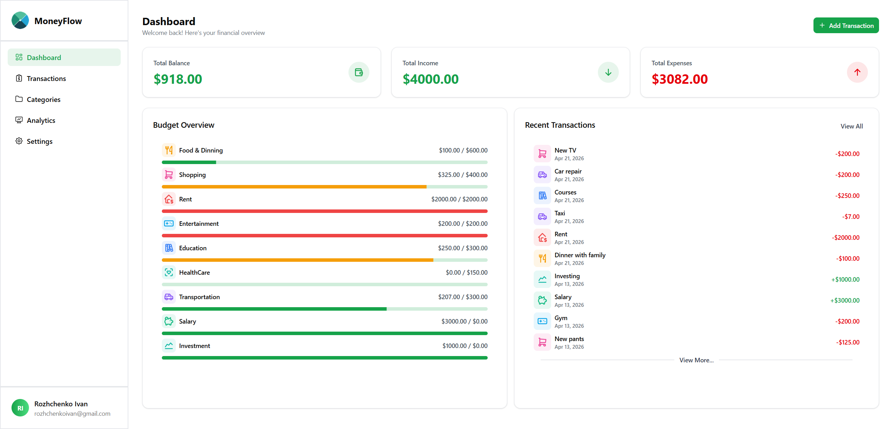
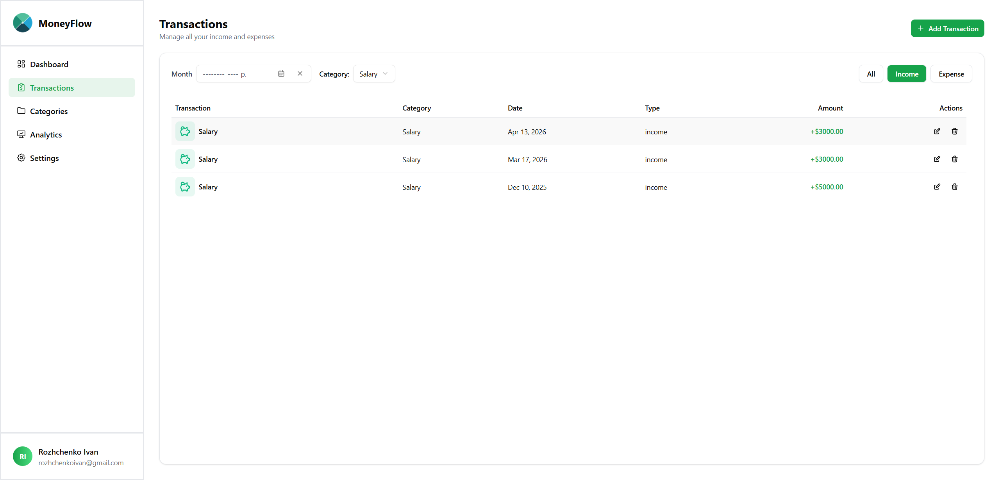
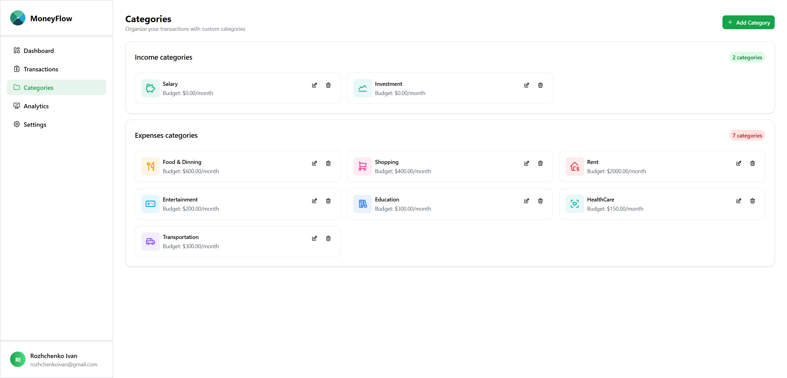
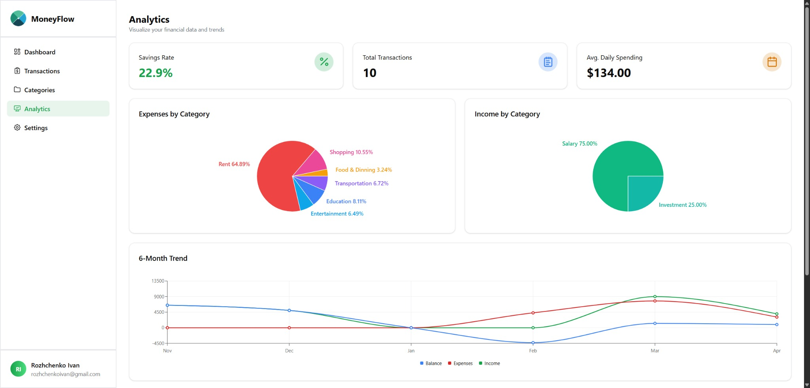
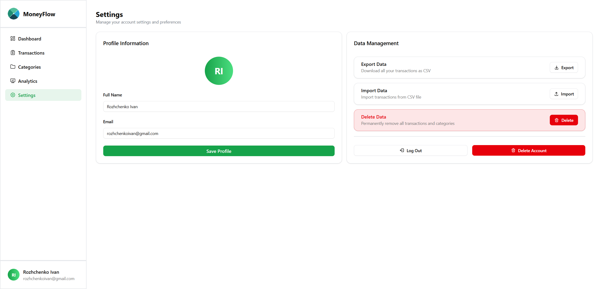
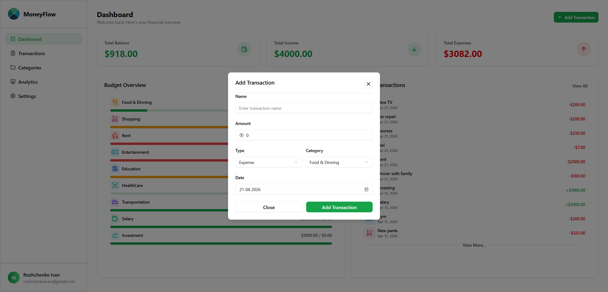
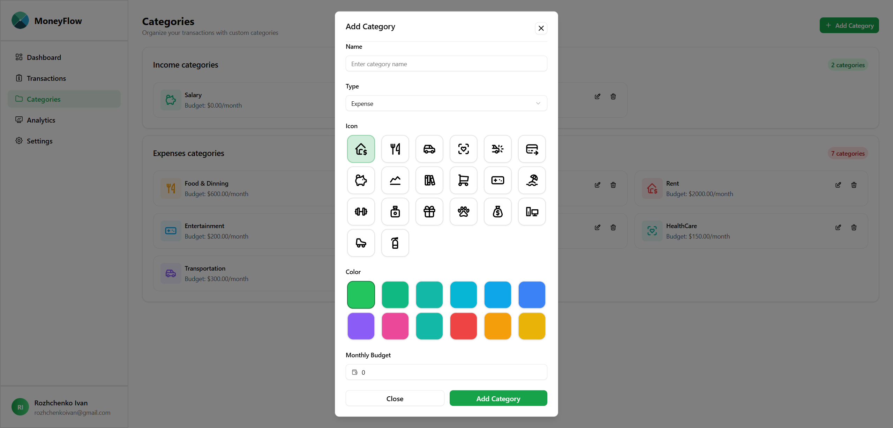

<h1>Personal Finance Dashboard</h1> 

  A scalable and modern <strong>personal finance management application</strong> built with 
  <strong>React</strong>, <strong>TypeScript</strong>, and <strong>Redux Toolkit</strong>.

  This project demonstrates real-world frontend architecture: API integration, global state management, 
  derived data handling, and a clean, reusable component system.

 

## Navigation
- [Key Highlights](#key-highlights)
- [Screenshots](#screenshots)
- [Features](#features)
- [Architecture](#architecture-overview)
- [Tech Stack](#tech-stack)
- [Getting Started](#getting-started)

 

<h2>Key Highlights</h2>
<ul>
  <li>Structured <strong>feature-based architecture</strong></li>
  <li>Advanced <strong>state management with Redux Toolkit</strong></li>
  <li>Separation of <strong>API layer, UI, and business logic</strong></li>
  <li>Dynamic <strong>filtering and derived selectors</strong></li>
  <li>Reusable and scalable <strong>UI component system</strong></li>
</ul>

 

<h2>Screenshots</h2>

<ul>
  <li><strong>Dashboard</strong></li> 
  
    

  <li><strong>Transactions</strong></li> 
  
    

  <li><strong>Categories</strong></li> 
  
    

  <li><strong>Analytics</strong></li> 
  
    

  <li><strong>Settings</strong></li> 
  
    

  <li><strong>Add Transaction</strong></li> 
  
    

  <li><strong>Add Category</strong></li> 
  
</ul>

 

<h2>Features</h2>

<h3>1. Transactions System</h3>
<ul>
  <li>Create, update, and delete transactions</li>
  <li>Pagination for efficient data handling</li>
  <li>Server-synced data with API requests</li>
</ul>

 

<h3>2. Categories Management</h3>
<ul>
  <li>Custom categories for transactions</li>
  <li>Default categories initialization</li>
  <li>Category-based filtering</li>
</ul>

 

<h3>3. Filtering & Query System</h3>
<ul>
  <li>Filter by <code>date range</code>, <code>category</code>, and <code>type</code></li>
  <li>Server-driven filtering logic</li>
</ul>

 

<h3>4. Dashboard & Analytics</h3>
<ul>
  <li>Monthly financial summary</li>
  <li>Income vs expenses tracking</li>
</ul>

 

<h3>5. Forms & UX</h3>
<ul>
  <li>Form handling with <strong>React Hook Form</strong></li>
  <li>Validation and controlled inputs</li>
  <li>Reusable form components</li>
</ul>

 

<h3>6. UI & Design</h3>
<ul>
  <li>Responsive layout with <strong>Tailwind CSS</strong></li>
  <li>Accessible components via <strong>shadcn/ui</strong></li>
  <li>Clean and modern interface</li>
</ul>

 

<h2>Architecture Overview</h2>
<ul>
  <li><strong>Feature-based structure</strong> (transactions, categories, dashboard)</li>
  <li><strong>Redux Toolkit slices</strong> for domain separation</li>
  <li><strong>Async thunks</strong> for API communication</li>
  <li><strong>Selectors</strong> for derived and memoized state</li>
  <li><strong>Service layer</strong> using Axios</li>
</ul>

 

<h2>Tech Stack</h2>

  <strong>
    <u>
      React, TypeScript, Redux Toolkit, Tailwind CSS, shadcn/ui, 
      React Hook Form, Axios, json-server
    </u>
  </strong>

 

<h2>Getting Started</h2>

<ol>
  <li>
    Clone the repository:
    <pre><code>git clone https://github.com/&lt;yourusername&gt;/personal-finance-dashboard.git</code></pre>
  </li>
  <li>
    Navigate to the project:
    <pre><code>cd personal-finance-dashboard</code></pre>
  </li>
  <li>
    Install dependencies:
    <pre><code>npm install</code></pre>
  </li>
  <li>
    Run development server:
    <pre><code>npm run dev</code></pre>
  </li>
  <li>
    Run mock API:
    <pre><code>npm run server</code></pre>
  </li>
</ol>
